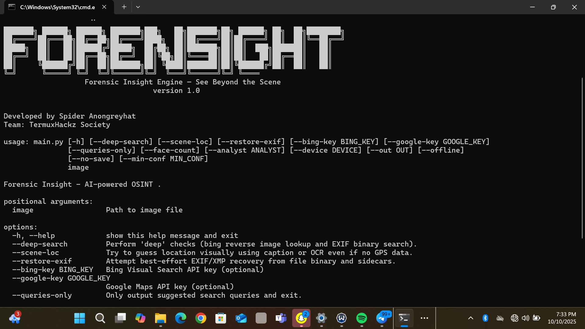

# Forensight

Forensight is an advanced image OSINT toolkit for investigative and analytical workflows. It allows you to extract metadata, perform reverse searches, detect objects and faces, run OCR, and handle a variety of image formats, all from the command line.

## Features

**Forensight** is a comprehensive image OSINT toolkit designed for investigators, analysts, and researchers. Its features include:

### Core Image Handling
- Read, write, and manipulate images in multiple formats, including advanced formats like AVIF.
- Resize, crop, rotate, and convert images.
- Compute image hashes for duplicate detection or similarity analysis.

### Metadata & Reverse Search
- Extract and analyze EXIF/XMP metadata from images.
- Restore missing or corrupted metadata.
- Perform automated reverse image searches.
- Retrieve geolocation, timestamps, and other embedded information.

### AI-Powered Analysis (Optional)
- Detect objects and people in images.
- Recognize scenes and generate descriptive captions.
- Classify images and extract visual features.
- Supports GPU acceleration for faster processing (optional).

### Face Recognition
- Detect and identify faces in images.
- Count faces and highlight them with bounding boxes.
- Compare faces against reference datasets for identification.

### OCR (Optical Character Recognition)
- Extract printed and handwritten text from images.
- Recognize multi-language text depending on configuration.

### Data Handling & Visualization
- Analyze numeric and tabular data associated with images.
- Map geolocated images and generate interactive visualizations.
- Create detailed investigation reports.

### Security, Signing & Encryption
- Sign images or investigation data for integrity verification.
- Encrypt sensitive files to protect investigation materials.
- Validate signatures to ensure authenticity.

### CLI Utilities
- User-friendly command-line interface for workflow automation.
- Display progress, logs, and status updates in the terminal.
- Combine multiple operations (e.g., metadata extraction + OCR + face detection) in a single run.
- Flexible argument parsing for customized workflows.

## Screenshots & Workflow

### Screenshot
  
*Example of Forensight running a metadata extraction and OCR workflow.*

### Workflow GIF
  
*Demonstrates a full workflow: metadata extraction → OCR → face detection → mapping.*
